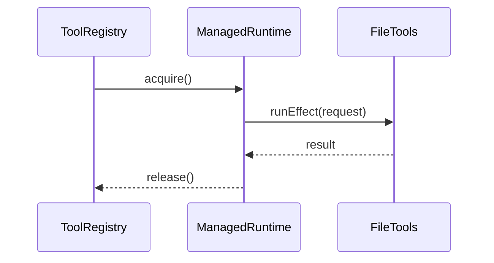

Cliq runs on a single event loop. Staying responsive means sequencing work with Effects instead of blocking calls and leveraging parallelism where it is safe.

## Parallelise independent work

```typescript title="src/persistence/SessionStore.ts"
const createSession = (directory: string, title: string) =>
  Effect.all([timestamp(), generateID()]).pipe(
    Effect.map(([now, id]) => ({
      id,
      projectID: hashProject(directory),
      directory,
      title,
      version: "0.1.0",
      time: { created: now, updated: now },
    })),
    Effect.tap(storeSession),
  );
```

- `Effect.all` runs timestamp + ID generation concurrently.
- Similar patterns appear in `Effect.forEach` when loading messages or gathering tool metadata.

## Stream with step budgets

```typescript title="src/services/VercelAI.ts"
return streamText({
  model,
  messages,
  tools,
  stopWhen: stepCountIs(maxSteps ?? config.maxSteps ?? 10),
  temperature: temperature ?? config.temperature,
  maxOutputTokens: config.maxTokens,
  providerOptions: normalizeProviderOptions(config) as never,
  onStepFinish,
});
```

- `stepCountIs` prevents runaway tool loops.
- `onStepFinish` surfaces tool calls/results while tokens are still streaming, giving immediate feedback.

## Stream text without blocking

```typescript title="src/chat/MessageService.ts"
const streamTextToConsole = (textStream: AsyncIterable<string>) =>
  Effect.promise(async () => {
    let text = "";
    for await (const chunk of textStream) {
      process.stdout.write(chunk);
      text += chunk;
    }
    const rendered = renderMarkdownToTerminal(text, 76);
    console.log("\n" + UI.indent(rendered, 2));
    return text;
  });
```

- Wrapping `AsyncIterable` consumption in an Effect keeps the generator linear and cancellable.
- Printing chunks immediately keeps the UI responsive, while re-rendering at the end ensures consistent formatting.

## Managed runtimes stay lightweight



- Each tool call spins up a fresh environment and tears it down immediately.
- No lingering file handles or background processes.

## Resource lifecycles

```typescript title="src/chat/ChatProgram.ts"
yield* Effect.acquireUseRelease(
  acquireReadline,
  ({ rl }) => runLoop(sessionId, messageService, rl),
  (resource, _exit) => releaseReadline(resource),
);
```

- Readline resources are reclaimed even on interrupts.
- You can apply the same pattern to custom resources (e.g., sockets, temp directories).

## Tips

- Raise `AI_MAX_STEPS` only when you expect multi-tool workflows; lower it for quick iteration.
- Batch related IO with `Effect.all` but keep heavy CPU work outside the event loop if possible.
- Profile real workloads: script a series of tool calls and watch the CLI remain interactive.

## Source

- `src/services/VercelAI.ts`
- `src/chat/MessageService.ts`
- `src/persistence/SessionStore.ts`
- `src/chat/ChatProgram.ts`

