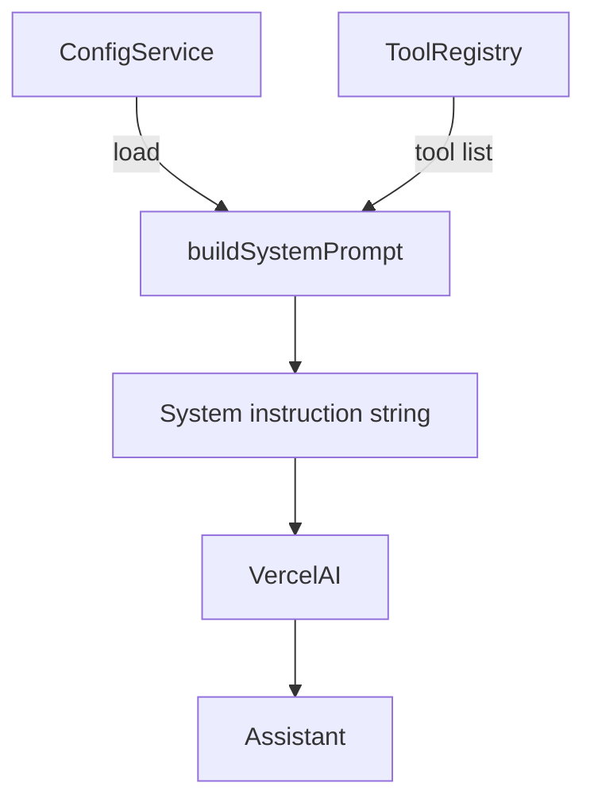

Cliq’s system prompt emphasises action over narration. It is generated dynamically so the assistant always knows the current provider, model, and registered tools.

## Dynamic builder

```typescript title="src/chat/systemPrompt.ts"
export const buildSystemPrompt = (config: SystemPromptConfig): string => {
  const { cwd, provider, model, maxSteps } = config

  return `You are a helpful coding assistant with access to file system tools.

Be concise in your responses. Focus on tool calls and actions. Do not provide explanations or reasoning unless explicitly asked by the user. Let tool outputs and results speak for themselves.

Prefer using editFile for modifications to existing files to generate diff previews. For new files, use writeFile but include a brief content summary if relevant.

Current working directory: ${cwd}
AI Provider: ${provider}
Model: ${model}
Max steps per request: ${maxSteps}

You have access to the following tools:
- readFile: Read file contents
- writeFile: Write content to a file
- fileExists: Check if a file or directory exists
- renderMarkdown: Parse and render markdown files
- listDirectories: List files and folders in a directory
- glob: Search for files using glob patterns
- grep: Search for text patterns in files using ripgrep
- editFile: Edit files using string replacement with diff preview
- previewEdit: Preview file edits without applying them

Guidelines:
1. Always read files before editing them to understand the current state
2. Use grep or glob to find files when you're unsure of locations
3. For edits, use editFile with clear oldString/newString pairs
4. Respect the project structure and conventions
5. Never access files outside the working directory
`
}
```

- Tool descriptions are generated from the registry, so adding/removing tools automatically updates the instructions.
- Provider and model names are embedded to reduce hallucinated capabilities.

## Flow



- `ConfigService` supplies provider/model context.
- `ToolRegistry` supplies the list of available operations.
- The resulting string is added to the top of the message history before each request.

## Tips

- Log the prompt when debugging sessions; it is reproducible text you can store alongside transcripts.
- Adjust the guidelines if you introduce new workflows (for example, repository-wide refactors).
- Keep the prompt concise—focus on rules that directly influence tool usage.

## Source

- `src/chat/systemPrompt.ts`
- `src/services/ConfigService.ts`
- `src/services/ToolRegistry.ts`
