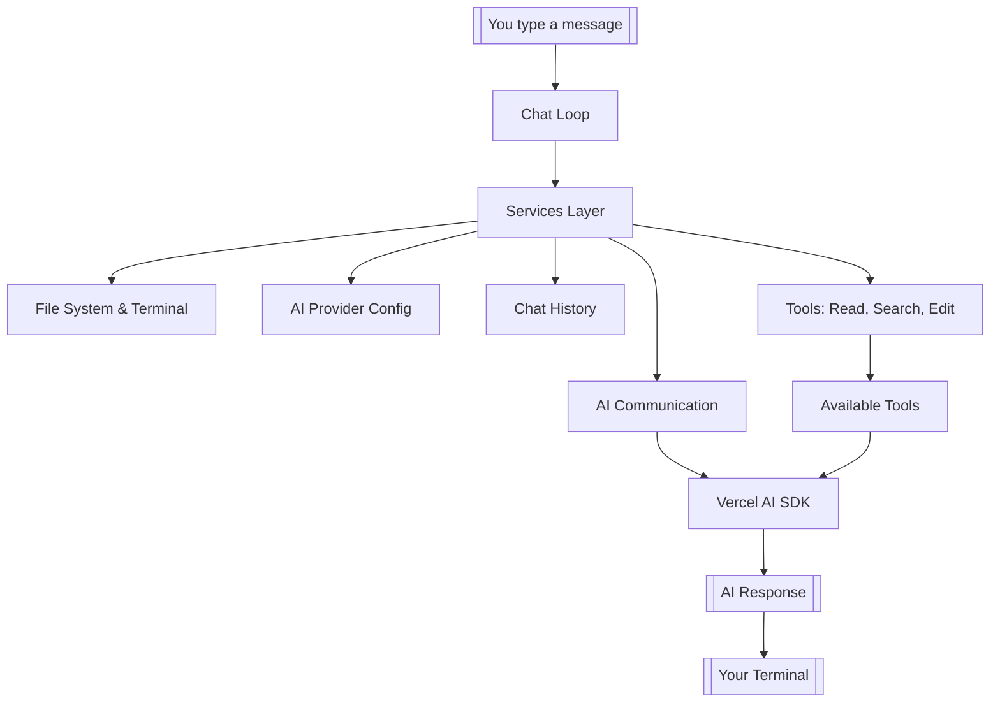

# Introduction

## What You'll Build

Welcome! In this guide, you'll build a fully functional AI coding assistant that runs in your terminal—similar to tools like Claude Code or Cursor, but one you control completely. Your assistant will read files, search codebases, make edits with preview diffs, and save conversation history.

More importantly, you'll understand exactly how AI agents work under the hood.

## Why This Guide Exists

Most AI coding assistants are black boxes. You type a request, magic happens, and code appears. But what if you want to customize which tools are available, swap between different AI providers (Anthropic, OpenAI, Google), or understand why the agent made a particular choice?

That's where Cliq comes in. It's a **reference implementation**—a working example you can learn from and modify. Think of it as the "build your own React" of AI coding agents. It's functional and useful, but deliberately kept simple enough to understand.

:::info Inspiration
Cliq is heavily inspired by [OpenCode](https://opencode.ai/), an open-source AI coding agent built for the terminal. While OpenCode focuses on production-ready features, Cliq explores similar concepts using Effect-TS to demonstrate functional programming patterns and explicit error handling.
:::

:::tip What Makes Cliq Different
Cliq isn't production software—it's a learning tool. The code is structured to teach you patterns for building reliable AI agents using Effect-TS, a TypeScript library that makes side effects explicit and composable.
:::

## The Tech Stack

You use tools that keep the code predictable and easy to modify:

- **Effect-TS** (v3.19+): A TypeScript library that treats side effects (API calls, file operations) as values you can compose. If you've used Result types or Maybe patterns, Effect is similar but more powerful. Learn more at [effect.website](https://effect.website/).
- **Vercel AI SDK** (v5.0+): Handles streaming communication with AI providers. Cliq wraps it in Effect for better control. Documentation available at [ai-sdk.dev](https://ai-sdk.dev/docs/introduction).
- **Bun** (v1.1+): A fast JavaScript runtime optimized for this project. The architectural patterns transfer to Node.js, but the reference CLI targets Bun exclusively. Visit [bun.com](https://bun.com/) for more information.
- **TypeScript** (v5.9+): Strict mode enabled for type safety.

## How Cliq Works

At a high level, Cliq connects several pieces:



Here's what happens when you chat with Cliq:

1. You type a message like "read my package.json"
2. The **chat loop** sends your message to the AI
3. The AI realizes it needs to read a file and calls the `readFile` tool
4. Your code validates the request and reads the file safely
5. The AI gets the file contents and responds to you
6. The conversation is saved for later

## What You Need to Start

- **TypeScript knowledge**: You should be comfortable with TypeScript and async/await patterns
- **API key**: Get one from Anthropic, OpenAI, or Google (Claude Haiku costs about $0.25 per million tokens—budget a few dollars for experimenting)
- **Curiosity about functional programming**: Effect-TS patterns show up throughout the project. If you're new to them, this guide explains each concept as it appears.

## How the Tutorial Works

The **[Build Series](/docs/build-series/overview)** walks through building Cliq step by step. Each step adds one feature:

1. Set up the basic structure
2. Configure AI providers
3. Add file reading
4. Build the chat loop
5. Add streaming responses
6. Add search tools
7. Add file editing with previews
8. Add markdown rendering
9. Add session persistence
10. Create custom tools
11. Optimize performance

By step 4, you'll have a working agent. Steps 5-11 add polish and advanced features.

## The Effect-TS Approach

Effect-TS is the key technology that makes Cliq predictable. Here's the core idea:

```typescript
// Traditional approach: side effects hidden
async function readFile(path: string) {
  return fs.readFile(path); // Might throw, might fail, unclear
}

// Effect approach: side effects explicit
const readFile = (path: string) =>
  Effect.gen(function* () {
    const fs = yield* FileSystem; // Explicit dependency
    const content = yield* fs.readFileString(path); // Explicit operation
    return content;
  });
```

With Effect:
- **Dependencies are explicit**: You can see what each function needs
- **Errors are typed**: You know what can go wrong
- **Testing is easier**: You can swap dependencies with test versions
- **Services compose**: You can mix and match pieces without rewriting code

Don't worry if this looks unfamiliar. You'll get comfortable with it as you build.

## What's Next

Ready to start? Head to the **[Build Series Overview](/docs/build-series/overview)** to begin building your AI agent.

Want to understand Effect-TS better first? Check out the **[Effect Deep Dive](/docs/effect/overview)**.

Curious about specific parts? Browse the **[Mechanics](/docs/mechanics/overview)** section to see how individual pieces work.

