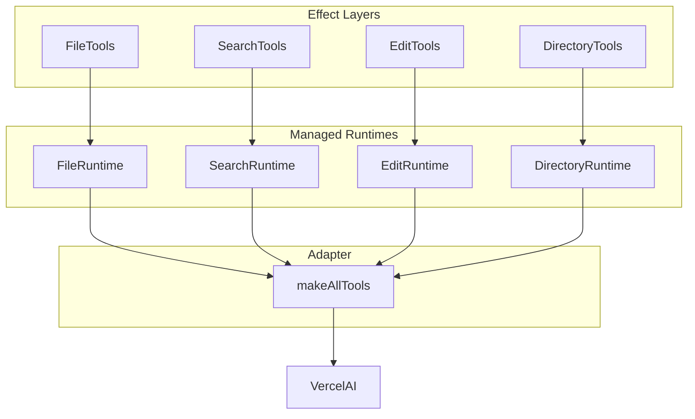

## Architecture



1. Each tool module defines a `Context.Tag` with Effect schemas.
2. `ToolRegistry` constructs a managed runtime per module, injecting Bun platform services and path validation.
3. `makeAllTools` adapts each runtime into the `ToolSet` consumed by `VercelAI.streamChat`.

## Managed runtimes

```typescript title="src/services/ToolRegistry.ts"
// Create a managed runtime with all dependencies
const fileToolsRuntime = ManagedRuntime.make(
  FileToolsLayer.pipe(
    Layer.provide(pathValidationStack),
    Layer.provide(BunContext.layer),
    Layer.orDie, // Convert layer failures to defects
  ),
);

// Adapt runtimes to Vercel AI SDK format
const toolsMap = makeAllTools(
  fileToolsRuntime,
  searchToolsRuntime,
  editToolsRuntime,
  directoryToolsRuntime,
);

return {
  tools: Effect.succeed(toolsMap),
  listToolNames: Effect.succeed(Object.keys(toolsMap).sort()),
};
```

- `ManagedRuntime.make` gives each service its own Effect environment.
- `Layer.orDie` converts checked layer failures into defects so tool execution cannot proceed without prerequisites.

## Adapter mapping

```typescript title="src/adapters/index.ts"
export const makeAllTools = (
  fileToolsRuntime: ManagedRuntime.ManagedRuntime<typeof FileTools>,
  searchToolsRuntime: ManagedRuntime.ManagedRuntime<typeof SearchTools>,
  editToolsRuntime: ManagedRuntime.ManagedRuntime<typeof EditTools>,
  directoryToolsRuntime: ManagedRuntime.ManagedRuntime<typeof DirectoryTools>,
): ToolSet => ({
  readFile: makeFileRead(fileToolsRuntime),
  writeFile: makeFileWrite(fileToolsRuntime),
  glob: makeSearchGlob(searchToolsRuntime),
  grep: makeSearchGrep(searchToolsRuntime),
  editFile: makeEditFile(editToolsRuntime),
  previewEdit: makePreviewEdit(editToolsRuntime),
  listDirectories: makeListDirectories(directoryToolsRuntime),
});
```

- Each adapter validates parameters with `@effect/schema`.
- Each adapter validates parameters with `zod`.
- The handler runs inside the managed runtime to access the correct services.
- Results are serialised to JSON automatically for the Vercel AI SDK.

## Execution flow

1. `VercelAI.streamChat` receives a tool call (`step.toolCalls`).
2. The adapter retrieves the appropriate runtime and executes the Effect.
3. The tool returns structured data; `ToolResultPresenter` renders it in the CLI.

## Tips

- Add new tools by creating a module + layer, adding a runtime in `ToolRegistry`, and extending `makeAllTools`.
- Reuse `PathValidation` in every tool that touches the filesystem to avoid leaving the workspace.
- Keep tool responses small and structured; the assistant summarises diffs and metadata more effectively than raw blobs.

## Source

- `src/services/ToolRegistry.ts`
- `src/adapters/index.ts`
- `src/tools/**/*.ts`

